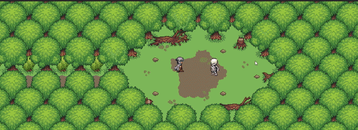
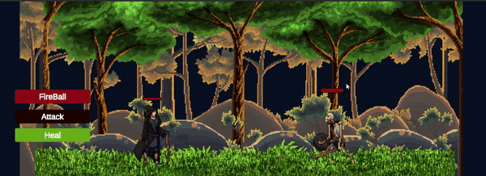
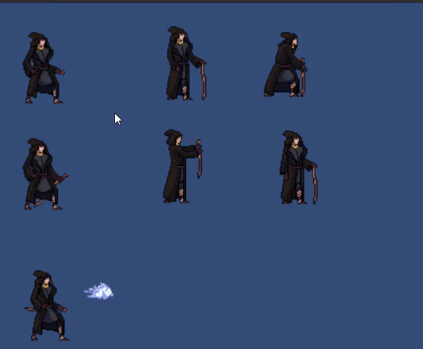

# Wizard
Inspired by games like Chrono Trigger, FFVI, and Octopath Traveler, my classmate [Benji](https://github.com/benji-hix), [Dustin](https://github.com/DustinYansberg) and I decided we wanted to try our hand at Unity.  Wizard is the result.  We had a great time working on this project, learning a ton as we went about Unity, version control and game development.

## Table of Contents
* [Technologies Used](#technologies-used)
* [Acknowledgements](#acknowledgements)
* [Features](#features)
* [Project Status](#project-status)
* [Room for Improvement](#room-for-improvement)
* [Contact](#contact)

## Technologies Used

- C# Unity

[Return to Table of Contents](#table-of-contents)

## Acknowledgements
>Big Thank You to [Benji](https://github.com/benji-hix) and [Dustin](https://github.com/DustinYansberg) for working super hard with me and being awesome collaborators during our final Project Week together.  We all put a lot of time and energy into this project including long hours of research, troubleshooting, and trial and error.  To be specific however:
- [Benji](https://github.com/benji-hix) is responsible for all of the asset sourcing, construction of the overworld, and player movement animations.
- I chose the music for the overworld, put together the animations for scene transitions and player and enemy battle actions, implemented scene transition with hitboxes, and helped [Dustin](https://github.com/DustinYansberg) with the combat system.
- [Dustin](https://github.com/DustinYansberg) designed and deployed the player battle UI and tied my animations to the battle scene as well as choosing the background art and music for the battle scene.
- Special thanks to [Tanner Person](https://www.linkedin.com/in/tannerperson/) for helping us get the ball rolling and for generally being awesome.
- Thanks to [Brackeys](https://www.youtube.com/@Brackeys) for the tutorials.
[Return to Table of Contents](#table-of-contents)

## Features
>Overworld
- Player movement and control was established by myself and fine-tuned by the the three of us as a team.
- Player starts in a clearing with a clear path to the right.

- Path leads through overworld's lovely scenery.

>Battle
- Path narrows into a clearing with a menacing skeleton.
- At a certain distance, player is pulled from overworld to battle scene.

- Carnage ensues

- We didn't get to use all of the animations I put together, so here's a gif. 

Video Demo:
[Download Video](wizard.mp4)

[Return to Table of Contents](#table-of-contents)

## Project Status
On the shelf for now, but I will revisit the concept in the future.

[Return to Table of Contents](#table-of-contents)

## Room for Improvement
Too much to list.  And finding free assets that fit together in a game was a challenge.  However, I think given we had 4 days and we'd all never touched Unity we did a pretty good job.

[Return to Table of Contents](#table-of-contents)

## Contact
[LINKEDIN](https://www.linkedin.com/in/joshua-bliek/)